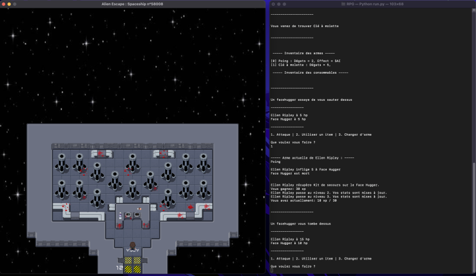

# README

Synopsis : Lors d'une patrouille interstellaire, vous recevez un message de détresse d'un autre vaisseau. Vous décidez de vous y rendre pour examiner la situation abord. En arrivant, vous découvrez un lieu vide et dans un état anormal. Vous commencez à prospecter à la recherche d'un signe de vie mais vous allez vite être confronté à d'étranges habitants...

Alien Escape Spaceship n°58008 est un jeu qui mélange visuel et textuel, les déplacements et les interactions avec les maps se font directement sur la fenêtre, et ce qui concerne les combats et l'inventaire vous aurez besoin du terminal pour interagir avec. 

 

## Prérequis : 
- Python 3.11 (https://www.python.org/downloads/)
- Python Arcade 2.6.17  (https://api.arcade.academy/en/latest/install/index.html) 

## Pour lancer le jeu * : 
- Installer Arcade : pip3 install arcade 
- Lancer run.py depuis votre terminal**

## Features : 
- Systeme d'xp
- Stat évolutive en fonction du niveau (ad + hp + def)
- Inventaire 
- Consommables avec différents effets
- Armes avec des effets à l'impact
- Changement d'arme pendant les combats 
- Armes trouvables dans les coffres
- Loot de consommable sur les mobs
- Combats contre des créatures
- Map ***
- Changement fluide entre les maps 
- Interaction sur la map pour activer des éléments du décor
- Musique de fond + sons lors d'interactions 
- Touche de Sprint 
- Animation du personnage 

## Contributeurs : 
Benjamin SCHINKEL 
Alessandro GARAU
Louisan TCHITOULA
Alexis JANUS 
Julien HEITZ 

*Si vous souhaitez découvrir toutes les fonctionnalités du jeu sans avoir à les chercher, nous vous invitons à lire le PDF : Présentation Alien Escape.pdf
**Il est possible que le jeu crash sur les macbook dotés d'une puce m1.
***La map, les sprites et les animations ont été réalisés par nous. 
